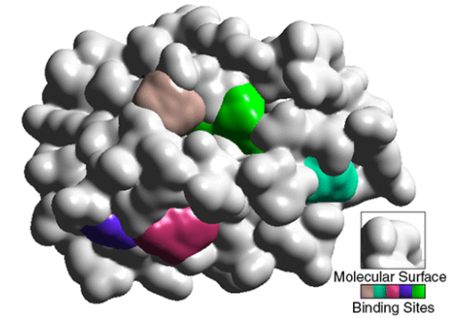

# CavVis

"Several geometric-based methods have been developed for the last two to three decades to detect and identify cavities (i.e., putative binding sites) on proteins, as needed to study protein–ligand interactions and protein docking. This paper introduces a new protein cavity method, called CavVis, which combines voxelization (i.e., a grid of voxels) and an analytic formulation of Gaussian surfaces that approximates the solvent-excluded surface. This method builds upon visibility of points on protein surface to find its cavities. Specifically, the visibility criterion combines three concepts we borrow from computer graphics, the field-of-view of each surface point, voxel ray casting, and back-face culling." See [CavVis' Paper](https://pubs.acs.org/doi/10.1021/acs.jcim.8b00572) for more details.

# Usage
For usage examples, type in the terminal:
> ./CavVis --help

# License
CavVis is licensed under GNU General Public License v3.0.
CavVis also uses some external third party libraries. Licenses for such third party libraries obey their own license.
